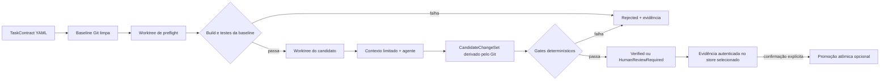

# AECS — Agentic Engineering Control System

O AECS é um protótipo de **plano de controle para engenharia de software com agentes de IA**. Ele transforma uma solicitação em um contrato explícito, avalia a execução contra limites de escopo e orçamento, verifica o resultado com ferramentas determinísticas e só então classifica a mudança como verificada, rejeitada ou pendente de revisão humana.

> **Status:** protótipo experimental com projetos `net8.0` e SDK .NET 9 fixado em `global.json`. A execução exige uma working tree limpa e avalia candidatos em worktrees Git descartáveis; o checkout original não recebe a mudança automaticamente.

## Por que este projeto existe

Agentes de programação conseguem produzir código, mas a resposta do modelo não é evidência suficiente de que uma mudança é segura. O AECS aplica o princípio:

> **Probabilistic discovery. Deterministic enforcement.**

Modelos podem descobrir padrões, selecionar contexto e propor alterações. Build, testes, limites de custo, escopo permitido e políticas críticas devem ser avaliados deterministicamente sempre que possível.

## Como funciona



O protótipo já inclui:

- contratos de tarefa em YAML;
- classificação de risco de R0 a R4;
- seleção de modelos locais por risco;
- execução via Ollama e fallback para APIs compatíveis com OpenAI;
- limites de tokens, custo, duração, tentativas e arquivos alterados;
- preflight da baseline e verificadores bloqueantes de agente, aplicação, mudança real, build, testes, escopo e orçamento;
- critérios de aceite ligados a verificadores ou testes filtrados com resultado TRX;
- verificadores semânticos EB001–EB005, com política para falhas críticas e gates explicitamente requeridos;
- compilação seletiva e limitada de contexto em toda execução staged;
- `CandidateChangeSet` derivado do Git e evidência canônica assinada em JSON ou PostgreSQL;
- promoção controlada ou exportação do patch como operações separadas;
- execução em lote com métricas como taxa de verificação e CPVC;
- REPL interativo, chamado Jarvis.

Consulte [Arquitetura atual](docs/architecture.md) para separar os componentes já conectados na CLI daqueles que ainda são fundação para etapas futuras.

## Pré-requisitos

- [.NET 9 SDK](https://dotnet.microsoft.com/download/dotnet/9.0), selecionado por `global.json`;
- [.NET 8 runtime](https://dotnet.microsoft.com/download/dotnet/8.0), necessário para executar os projetos AECS `net8.0`;
- Git, recomendado para revisar e descartar mudanças produzidas pelo agente;
- [Ollama](https://ollama.com/), opcional para execução com modelo local;
- Docker, opcional para subir o PostgreSQL definido no repositório.

O PostgreSQL é opcional: `json` permanece o backend padrão local, enquanto `postgres` pode ser selecionado explicitamente em todos os fluxos da CLI. O CI provisiona PostgreSQL 16 para os testes reais do store.

## Início rápido

Na raiz do repositório:

```powershell
dotnet restore AECS.slnx
dotnet build AECS.slnx
dotnet test AECS.slnx
```

O CI executa separadamente a suíte E2E reproduzível do AgronomoPlus. Ela usa um fixture
versionado `net9.0`, cria repositórios Git temporários e cobre candidato válido, violação
adversarial de escopo e promoção do diff verificado. O relatório e as evidências JSON são
publicados como artifact:

```powershell
$env:AECS_E2E_REPORT_PATH = Join-Path $env:TEMP "aecs-real-world-e2e/report.json"
dotnet test tests/AECS.IntegrationTests/AECS.IntegrationTests.csproj `
  --filter "Category=RealWorldE2E"
```

Os contratos, candidatos determinísticos e resultados esperados ficam em
[`tests/fixtures/real-world-demo/`](tests/fixtures/real-world-demo/).

Para explorar o Jarvis sem chamar um modelo e sem aplicar blocos de código:

```powershell
dotnet run --project src/AECS.Cli/AECS.Cli.csproj -- jarvis --repo . --mock
```

Dentro do REPL:

```text
aecs> help
aecs> risk Add validation to CustomerService
aecs> context TASK-001
aecs> exit
```

O adaptador mock simula metadados de uma execução. Ele é apropriado para exercitar o fluxo de controle, mas não comprova a qualidade de uma alteração real.

### Evidência em PostgreSQL

Connection strings são recebidas somente por variável de ambiente ou `.env` não versionado. Depois de configurar `AECS_POSTGRES_CONNECTION_STRING`, selecione o backend com `--evidence-store postgres` ou `AECS_EVIDENCE_STORE=postgres`. Uma indisponibilidade falha fechado e nunca aciona fallback silencioso para JSON.

```powershell
$env:AECS_POSTGRES_PASSWORD = '<segredo-local>'
docker compose up -d postgres
$env:AECS_POSTGRES_CONNECTION_STRING = `
  "Host=localhost;Port=5432;Database=aecs;Username=aecs;Password=$env:AECS_POSTGRES_PASSWORD"
```

Setup, migrations, backup e recuperação estão em [Store PostgreSQL de evidências](docs/postgresql-evidence-store.md).

## Executar uma tarefa

Uma execução individual recebe o repositório-alvo e um contrato YAML:

```powershell
dotnet run --project src/AECS.Cli/AECS.Cli.csproj -- run `
  --repo C:\caminho\para\repositorio `
  --task-file C:\caminho\para\contrato.yaml `
  --evidence-store json `
  --mock
```

Remova `--mock` para usar o Ollama. O AECS espera o serviço em `http://localhost:11434` e seleciona atualmente:

- `qwen2.5-coder:7b` para R0/R1;
- `qwen2.5-coder:14b` para R2/R3/R4.

Prepare os modelos antes da primeira execução real:

```powershell
ollama pull qwen2.5-coder:7b
ollama pull qwen2.5-coder:14b
ollama serve
```

> **Atenção:** respostas reais no formato `FILE: caminho` são aplicadas primeiro em um worktree descartável. O checkout original só recebe o diff em uma segunda ação explícita de promoção, após a validação da evidência, do commit-base e do hash confirmado pelo operador.

### Promover ou exportar um candidato

O comando `run` informa o `Evidence ID` e o `Diff hash`. A evidência é selada com RSA-PSS/SHA-256; qualquer alteração no envelope ou em sua cadeia de eventos bloqueia as operações seguintes. Para aplicar um candidato `Verified` no mesmo repositório em que a evidência foi produzida:

```powershell
dotnet run --project src/AECS.Cli/AECS.Cli.csproj -- promote `
  --repo C:\caminho\para\repositorio `
  --evidence <evidence-id> `
  --diff-hash <sha256-do-candidato> `
  --actor operador@example.com `
  --evidence-store json `
  --confirm
```

A promoção exige o checkout limpo, na mesma branch e no mesmo commit da baseline. O patch é validado, aplicado atomicamente e deixado no index do Git para inspeção; o AECS não cria commit. Em vez de `--confirm`, uma automação pode informar `--policy <referência>` e uma decisão `HumanReviewRequired` pode usar `--human-approval <referência>`.

Para revisão externa, exporte o patch sem modificar o repositório-alvo:

```powershell
dotnet run --project src/AECS.Cli/AECS.Cli.csproj -- export-patch `
  --evidence <evidence-id> `
  --diff-hash <sha256-do-candidato> `
  --output C:\revisoes\candidate.patch `
  --evidence-store json `
  --actor operador@example.com
```

O destino precisa estar fora do repositório-alvo e não pode existir. Ambas as ações acrescentam um evento assinado e encadeado com ator, confirmação, baseline, hash e resultado. Consulte [Promoção controlada](docs/controlled-promotion.md) para as garantias e os casos de recusa e [Integridade das evidências](docs/evidence-integrity.md) para envelope, chaves e rotação.

### Reproduzir uma evidência

O replay reconstrói o candidato e repete ferramentas, comandos, gates e evidências de aceite num worktree descartável, sem chamar o agente nem alterar o checkout original:

```powershell
dotnet run --project src/AECS.Cli/AECS.Cli.csproj -- replay `
  --repo C:\caminho\para\repositorio `
  --evidence <evidence-id> `
  --evidence-store json
```

O resultado separa baseline ausente, divergência do candidato, divergência do ambiente e gate não reproduzível. Cada tentativa válida vira um evento de replay assinado e ligado à evidência original. Consulte [Replay de evidências](docs/evidence-replay.md).

### Fallback em nuvem

O comando `run` e o modo `experiment` tentam o Ollama primeiro. Se a execução local falhar ou não produzir arquivos, podem recorrer a uma API com endpoint compatível com `POST /chat/completions` da OpenAI.

Copie o exemplo de configuração e não versione o arquivo resultante:

```powershell
Copy-Item .env.example .env
```

Variáveis reconhecidas:

| Variável | Finalidade |
| --- | --- |
| `OPENAI_API_KEY` | Chave da API compatível com OpenAI |
| `OPENAI_MODEL` | Identificador do modelo usado no fallback |
| `OPENAI_BASE_URL` | URL-base da API, sem `/chat/completions` |
| `AECS_EVIDENCE_STORE` | Backend padrão: `json` ou `postgres` |
| `AECS_EVIDENCE_PATH` | Diretório do backend JSON |
| `AECS_EVIDENCE_KEY_DIRECTORY` | Keyring fora do repositório-alvo |
| `AECS_POSTGRES_CONNECTION_STRING` | Segredo de conexão exigido pelo backend PostgreSQL |
| `ANTHROPIC_API_KEY`, `ANTHROPIC_MODEL`, `ANTHROPIC_BASE_URL` | Aliases legados usados quando as variáveis `OPENAI_*` não existem |

As opções `--cloud-key`, `--cloud-model` e `--cloud-url` sobrescrevem as variáveis de ambiente. O REPL Jarvis ainda usa somente Ollama ou mock e não monta o fallback cloud.

Apesar dos aliases `ANTHROPIC_*`, o adaptador não implementa o protocolo nativo da Anthropic: a URL configurada ainda precisa expor uma API compatível com OpenAI.

## Executar um experimento

O modo de experimento processa todos os arquivos `.yaml` e `.yml` de um diretório, em ordem alfabética:

```powershell
dotnet run --project src/AECS.Cli/AECS.Cli.csproj -- experiment `
  --repo C:\caminho\para\repositorio `
  --tasks tasks/real-project `
  --mock
```

O relatório inclui decisão por tarefa, duração, custo estimado, quantidade de arquivos, taxa de verificação na primeira tentativa e **Cost per Verified Change (CPVC)**.

## Contratos de tarefa

Cada tarefa declara objetivo, critérios de aceite, escopo, restrições, orçamento, verificações e política de aprovação:

```yaml
task:
  id: TASK-001
  objective: Fix NullReferenceException in CustomerMapper when input is null
  acceptance:
    - Null input returns an empty result
    - Existing tests still pass
  acceptance_evidence:
    - id: AC-001
      type: test
      reference: FullyQualifiedName~CustomerMapperTests.NullCustomer
      test_path: tests/Customers/CustomerMapperTests.cs
      behavioral: true
    - id: AC-002
      type: verifier
      reference: Tests
  scope:
    allowed:
      - src/Customers/**
      - tests/Customers/**
    forbidden:
      - src/Billing/**
  constraints:
    security_risk: low
    database_migration: false
    external_dependency: false
  budget:
    tokens: 60000
    usd: 0.20
    retries: 1
    wall_clock_seconds: 120
    max_files_changed: 5
  execution:
    working_directory: .
    target: CustomerSystem.slnx
  verification:
    build: required
    unit_tests: required
    scope: required
  approval:
    production: none
```

A referência de campos, padrões de escopo, valores padrão e regras de decisão está em [TaskContract](docs/task-contract.md). Os YAMLs em [`tasks/`](tasks/) são modelos de contrato; o exemplo realmente executado em CI fica no [fixture AgronomoPlus](tests/fixtures/real-world-demo/README.md).

## Comandos da CLI

| Modo | Exemplo | Uso |
| --- | --- | --- |
| Tarefa única | `run --repo <path> --task-file <file> --evidence-store <json\|postgres>` | Executa e verifica um contrato |
| Experimento | `experiment --repo <path> --tasks <dir> --evidence-store <json\|postgres>` | Executa um conjunto de contratos |
| Jarvis | `jarvis --repo <path> --evidence-store <json\|postgres>` | Abre o REPL interativo |
| Promoção | `promote --repo <path> --evidence <id> --diff-hash <hash> --actor <ator> --confirm` | Aplica e prepara no index um candidato elegível |
| Exportação | `export-patch --evidence <id> --diff-hash <hash> --output <file> --actor <ator>` | Exporta o diff sem aplicá-lo |
| Replay | `replay --repo <path> --evidence <id> --evidence-store <json\|postgres>` | Reproduz candidato e gates sem chamar o agente |
| Rotação de chave | `evidence-key rotate [--key-directory <path>]` | Gera nova chave ativa e preserva as chaves públicas históricas |

Comandos disponíveis dentro do Jarvis:

| Comando | Descrição |
| --- | --- |
| `run <task-file>` | Executa uma tarefa |
| `experiment <dir>` | Executa os YAMLs do diretório |
| `status` | Mostra a última execução da sessão |
| `history` | Lista o histórico em memória da sessão |
| `explain <task-id>` | Explica a decisão registrada na sessão |
| `risk <objective>` | Classifica um objetivo sem executar um agente |
| `context <task-id>` | Mostra o pacote de contexto selecionado |
| `exit` | Encerra o REPL |

## Estrutura do repositório

```text
src/
├── AECS.Domain/          # Entidades, enums, contratos e interfaces
├── AECS.Application/     # Orquestração, políticas, verificadores e experimentos
├── AECS.Infrastructure/  # Agentes, persistência e sandbox
└── AECS.Cli/             # Entry point e Jarvis REPL
tests/
├── AECS.UnitTests/
├── AECS.IntegrationTests/
└── fixtures/real-world-demo/ # contratos e repositório E2E reproduzível
docs/
└── adr/                  # Registros de decisões arquiteturais
tasks/                    # TaskContracts de exemplo e de experimento
```

## Documentação

- [Arquitetura atual](docs/architecture.md) — fluxo, componentes, fronteiras e limitações;
- [Referência do TaskContract](docs/task-contract.md) — schema YAML e semântica dos campos;
- [Promoção controlada](docs/controlled-promotion.md) — confirmação, invariantes, atomicidade e auditoria;
- [Integridade das evidências](docs/evidence-integrity.md) — envelope assinado, keyring, rotação e limites;
- [Replay de evidências](docs/evidence-replay.md) — reconstrução agentless, comparações e classificação de divergências;
- [Store PostgreSQL](docs/postgresql-evidence-store.md) — configuração, migrations, concorrência, backup e indisponibilidade;
- [Índice de ADRs](docs/adr/README.md) — decisões arquiteturais aceitas;
- [Fundação técnica v0.1](AECS_Fundacao_Tecnica_v0.1.md) — tese, visão de longo prazo e roadmap original.

## Limitações conhecidas

- a promoção é deliberadamente manual ou autorizada por uma referência de política e deixa as mudanças staged, sem criar commit;
- a telemetria final do provedor ainda é necessária para detectar eventual consumo acima da estimativa preventiva de tokens/custo;
- o keyring RSA local não substitui KMS/HSM nem detecta rollback integral para uma versão antiga validamente assinada;
- o isolamento Docker possui infraestrutura inicial, mas não envolve a execução padrão;
- `security_scan: required` falha fechado porque ainda não existe implementação do verificador `SecurityScan`;
- o indexador de contexto atual é específico para arquivos C# e usa estimativa aproximada de quatro caracteres por token;
- a CLI é um protótipo e sua interface ainda pode mudar sem compatibilidade retroativa.

Essas limitações são deliberadamente explícitas: hoje o AECS é uma base de pesquisa executável, não um gate de produção pronto para uso autônomo.
