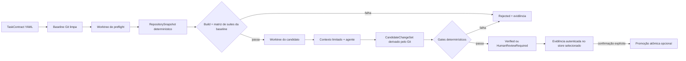

# AECS — Agentic Engineering Control System

O AECS é um protótipo de **plano de controle para engenharia de software com agentes de IA**. Ele transforma uma solicitação em um contrato explícito, avalia a execução contra limites de escopo e orçamento, verifica o resultado com ferramentas determinísticas e só então classifica a mudança como verificada, rejeitada ou pendente de revisão humana.

> **Status:** protótipo experimental com projetos `net8.0` e SDK .NET 9 selecionado por `global.json`. Essa matriz é transitória e está documentada em [Suporte .NET](docs/dotnet-support.md). A execução exige uma working tree limpa, avalia candidatos em worktrees Git descartáveis e executa comandos do repositório em sandbox Docker por padrão; o checkout original não recebe a mudança automaticamente.

## Por que este projeto existe

Agentes de programação conseguem produzir código, mas a resposta do modelo não é evidência suficiente de que uma mudança é segura. O AECS aplica o princípio:

> **Probabilistic discovery. Deterministic enforcement.**

Modelos podem descobrir padrões, selecionar contexto e propor alterações. Build, testes, limites de custo, escopo permitido e políticas críticas devem ser avaliados deterministicamente sempre que possível.

## Como funciona



O protótipo já inclui:

- contratos de tarefa em YAML;
- classificação de risco de R0 a R4;
- seleção de modelos locais por risco;
- execução via Ollama e fallback para APIs compatíveis com OpenAI;
- limites de tokens, custo, duração, tentativas e arquivos alterados;
- Adaptive Controller em shadow mode, alimentado somente por evidências autenticadas e sem
  alterar modelo, contexto, orçamento ou capabilities da execução fixa;
- gate causal offline para comparar, em pares isolados e retomáveis, o plano fixo e recomendações
  adaptativas pré-registradas sem ativá-las no fluxo operacional;
- `RepositorySnapshot` versionado e endereçado por conteúdo, com inventário da baseline e relações entre soluções e projetos;
- `CSharpSymbolGraph` versionado e endereçado por conteúdo, extraído por Roslyn/MSBuild com tipos, membros, herança, implementação e referências;
- preflight da baseline e gates versionados independentes para unitários, integração e aceite, com modos required/optional/disabled e contagem TRX;
- critérios de aceite ligados a verificadores ou testes filtrados com resultado TRX;
- verificadores semânticos EB001–EB004 por diff de grafos Roslyn e EB005 alimentado por decisões históricas versionadas, revisadas e persistidas;
- compilação seletiva e limitada de contexto em toda execução staged;
- `CandidateChangeSet` derivado do Git e evidência canônica assinada em JSON ou PostgreSQL;
- promoção controlada ou exportação do patch como operações separadas;
- execução em lote com métricas como taxa de verificação e CPVC;
- experimentos reproduzíveis por dataset versionado, variantes, repetições, checkpoints,
  comparação pareada e protocolo A/B pré-registrado para o Context Compiler;
- REPL interativo, chamado Jarvis.

Consulte [Arquitetura atual](docs/architecture.md) para separar os componentes já conectados na CLI daqueles que ainda são fundação para etapas futuras. O fluxo e a matriz de fixtures de EB001–EB004 estão em [Verificação semântica](docs/semantic-verification.md), o ciclo do EB005 está em [Registro histórico](docs/historical-decision-registry.md) e a infraestrutura de A/B está em [Experiment Harness](docs/experiment-harness.md).

## Pré-requisitos

- [.NET 9 SDK estável](https://dotnet.microsoft.com/download/dotnet/9.0), selecionado por `global.json` sem aceitar previews;
- [.NET 8 runtime](https://dotnet.microsoft.com/download/dotnet/8.0), necessário para executar os projetos AECS `net8.0`;
- Git, recomendado para revisar e descartar mudanças produzidas pelo agente;
- [Ollama](https://ollama.com/), opcional para execução com modelo local;
- Docker, obrigatório para a execução staged padrão e opcional apenas quando um contrato confiável usa o override de desenvolvimento no host.

O PostgreSQL é opcional: `json` permanece o backend padrão local, enquanto `postgres` pode ser selecionado explicitamente em todos os fluxos da CLI. O CI provisiona PostgreSQL 16 para os testes reais do store.

A distinção entre TFM do produto, runtime, SDK do controlador, imagem staged e fixture E2E está na
[matriz de suporte .NET](docs/dotnet-support.md). .NET 8 e .NET 9 encerram suporte em 2026-11-10;
a migração técnica para .NET 10 LTS precisa ocorrer antes dessa data.

## Início rápido

Na raiz do repositório:

```powershell
dotnet restore AECS.slnx
dotnet build AECS.slnx
dotnet test AECS.slnx
```

O CI executa a suíte E2E reproduzível do AgronomoPlus em um job independente e paralelo ao feedback
principal. Ela usa um projeto de fixture `net9.0` — não o TFM do produto —, cria repositórios Git
temporários e cobre candidato válido, violação adversarial de escopo e promoção do mesmo diff
verificado, sem repetir o pipeline válido. Um hang de cinco minutos produz diagnóstico próprio sem
impedir os demais smokes. O relatório e as evidências JSON são publicados como artifact:

```powershell
$env:AECS_E2E_REPORT_PATH = Join-Path $env:TEMP "aecs-real-world-e2e/report.json"
dotnet test tests/AECS.IntegrationTests/AECS.IntegrationTests.csproj `
  --filter "Category=RealWorldE2E"
```

Os contratos, candidatos determinísticos e resultados esperados ficam em
[`tests/fixtures/real-world-demo/`](tests/fixtures/real-world-demo/).

Para explorar o Jarvis sem chamar um modelo e sem aplicar blocos de código:

```powershell
dotnet run --project src/AECS.Cli/AECS.Cli.csproj -- jarvis --repo . --mock
```

Alertas proativos são opt-in. Depois de habilitar uma cópia local de
`aecs.alert-policy.example.json`, passe `--alert-policy <arquivo>` ao Jarvis. Execuções passam a
gerar alertas locais calibrados para segurança, scope, budget, falhas repetidas, regressão e revisão
humana; nenhum alerta aplica patch ou transforma silêncio em aprovação. Consulte [Alertas
proativos](docs/proactive-alerts.md).

### Cliente VS Code

O cliente mínimo em `clients/vscode` inicia TaskContracts, restaura o vínculo após reinício, mostra
diff, gates, critérios, budget e links de evidência, e registra aprovação/rejeição pelo backend. A
extensão não aplica patches nem promove candidatos. Instalação, compatibilidade, protocolo
autenticado e modelo de ameaças estão em [Cliente VS Code](docs/vscode-client.md).

`run`, `experiment` e Jarvis resolvem o mesmo runtime. Use `--runtime-config
aecs.runtime.local.json` para selecionar um arquivo versionado e `--show-effective-config` para
ver valores e origens efetivas em JSON, sempre com segredos redigidos.

Dentro do REPL:

```text
aecs> help
aecs> risk Add validation to CustomerService
aecs> context TASK-001
aecs> review <evidence-id> --policy policy/team-v1
aecs> export-patch <evidence-id> C:\revisoes\candidate.patch
aecs> exit
```

`review` mostra baseline, estado atual do repositório, risco, decisão, elegibilidade, gates,
arquivos e diff autenticado. A decisão `approve`, `reject` ou `abandon` registra ator do processo,
justificativa, validade e referência de política. Uma aprovação ainda exige a confirmação literal
`PROMOTE <diff-hash>` imediatamente antes de chamar a promoção controlada; confirmação diferente
é registrada como abandono e não altera o checkout.

O adaptador mock simula metadados de uma execução. Ele é apropriado para exercitar o fluxo de controle, mas não comprova a qualidade de uma alteração real.

### Evidência em PostgreSQL

Connection strings são recebidas somente por variável de ambiente ou `.env` não versionado. Depois de configurar `AECS_POSTGRES_CONNECTION_STRING`, selecione o backend com `--evidence-store postgres` ou `AECS_EVIDENCE_STORE=postgres`. Uma indisponibilidade falha fechado e nunca aciona fallback silencioso para JSON.

```powershell
$env:AECS_POSTGRES_PASSWORD = '<segredo-local>'
docker compose up -d postgres
$env:AECS_POSTGRES_CONNECTION_STRING = `
  "Host=localhost;Port=5432;Database=aecs;Username=aecs;Password=$env:AECS_POSTGRES_PASSWORD"
```

Setup, migrations, backup e recuperação estão em [Store PostgreSQL de evidências](docs/postgresql-evidence-store.md).

## Executar uma tarefa

Uma execução individual recebe o repositório-alvo e um contrato YAML:

```powershell
dotnet run --project src/AECS.Cli/AECS.Cli.csproj -- run `
  --repo C:\caminho\para\repositorio `
  --task-file C:\caminho\para\contrato.yaml `
  --evidence-store json `
  --mock
```

Remova `--mock` para usar o Ollama. O AECS espera o serviço em `http://localhost:11434` e seleciona atualmente:

- `qwen2.5-coder:7b` para R0/R1;
- `qwen2.5-coder:14b` para R2/R3/R4.

Prepare os modelos antes da primeira execução real:

```powershell
ollama pull qwen2.5-coder:7b
ollama pull qwen2.5-coder:14b
ollama serve
```

> **Atenção:** respostas reais no formato `FILE: caminho` são aplicadas primeiro em um worktree descartável. O checkout original só recebe o diff em uma segunda ação explícita de promoção, após a validação da evidência, do commit-base e do hash confirmado pelo operador.

### Promover ou exportar um candidato

O comando `run` informa o `Evidence ID` e o `Diff hash`. A evidência é selada com RSA-PSS/SHA-256; qualquer alteração no envelope ou em sua cadeia de eventos bloqueia as operações seguintes. Para aplicar um candidato `Verified` no mesmo repositório em que a evidência foi produzida:

```powershell
dotnet run --project src/AECS.Cli/AECS.Cli.csproj -- promote `
  --repo C:\caminho\para\repositorio `
  --evidence <evidence-id> `
  --diff-hash <sha256-do-candidato> `
  --actor operador@example.com `
  --evidence-store json `
  --confirm
```

A promoção exige o checkout limpo, na mesma branch e no mesmo commit da baseline. O patch é validado, aplicado atomicamente e deixado no index do Git para inspeção; o AECS não cria commit. Em vez de `--confirm`, uma automação pode informar `--policy <referência>` e uma decisão `HumanReviewRequired` pode usar `--human-approval <referência>`.

Para revisão externa, exporte o patch sem modificar o repositório-alvo:

```powershell
dotnet run --project src/AECS.Cli/AECS.Cli.csproj -- export-patch `
  --evidence <evidence-id> `
  --diff-hash <sha256-do-candidato> `
  --output C:\revisoes\candidate.patch `
  --evidence-store json `
  --actor operador@example.com
```

O destino precisa estar fora do repositório-alvo e não pode existir. Ambas as ações acrescentam um evento assinado e encadeado com ator, confirmação, baseline, hash e resultado. Consulte [Promoção controlada](docs/controlled-promotion.md) para as garantias e os casos de recusa e [Integridade das evidências](docs/evidence-integrity.md) para envelope, chaves e rotação.

### Reproduzir uma evidência

O replay reconstrói o snapshot da baseline e o candidato, compara o inventário e repete ferramentas, comandos, gates e evidências de aceite num worktree descartável, sem chamar o agente nem alterar o checkout original:

```powershell
dotnet run --project src/AECS.Cli/AECS.Cli.csproj -- replay `
  --repo C:\caminho\para\repositorio `
  --evidence <evidence-id> `
  --evidence-store json
```

O resultado separa baseline ausente, divergência do candidato, divergência do ambiente e gate não reproduzível. Cada tentativa válida vira um evento de replay assinado e ligado à evidência original. Consulte [Replay de evidências](docs/evidence-replay.md).

### Consultar o Evidence Graph

As evidências autenticadas podem ser listadas, inspecionadas e rastreadas por causalidade sem um banco de grafo separado:

```powershell
dotnet run --project src/AECS.Cli/AECS.Cli.csproj -- evidence list `
  --repo C:\caminho\para\repositorio `
  --decision Verified

dotnet run --project src/AECS.Cli/AECS.Cli.csproj -- evidence trace `
  --repo C:\caminho\para\repositorio `
  --evidence <evidence-id> `
  --format dot
```

Filtros por task, run, candidato, baseline, decisão e promoção são combináveis. JSON e DOT podem ser redirecionados para arquivos; consultas ficam restritas ao caminho exato do repositório autenticado. Consulte [Evidence Graph](docs/evidence-graph.md).

### Runtime local e fallback em nuvem

`run`, o experimento por diretório e Jarvis tentam o Ollama primeiro através do mesmo composition
root. Cloud fica desabilitado por padrão, mesmo quando há uma chave no ambiente. Quando habilitado
e autorizado, falhas transitórias, timeout, 429 ou indisponibilidade local podem recorrer a uma
API compatível com `POST /chat/completions` da OpenAI.

Copie o exemplo de configuração e não versione o arquivo resultante:

```powershell
Copy-Item .env.example .env
```

Variáveis reconhecidas:

| Variável | Finalidade |
| --- | --- |
| `OPENAI_API_KEY` | Chave da API compatível com OpenAI |
| `OPENAI_MODEL` | Identificador do modelo usado no fallback |
| `OPENAI_BASE_URL` | URL-base da API, sem `/chat/completions` |
| `AECS_EVIDENCE_STORE` | Backend padrão: `json` ou `postgres` |
| `AECS_EVIDENCE_PATH` | Diretório do backend JSON |
| `AECS_EVIDENCE_KEY_DIRECTORY` | Keyring fora do repositório-alvo |
| `AECS_POSTGRES_CONNECTION_STRING` | Segredo de conexão exigido pelo backend PostgreSQL |
| `ANTHROPIC_API_KEY`, `ANTHROPIC_MODEL`, `ANTHROPIC_BASE_URL` | Aliases legados usados quando as variáveis `OPENAI_*` não existem |
| `AECS_RUNTIME_CONFIG` | Caminho do contrato `aecs.runtime-config/v1` |
| `AECS_ALERT_POLICY` | Caminho da política opt-in `aecs.alert-policy/v1` usada pelo Jarvis |
| `AECS_ALERT_PATH` | Root local do estado e inbox de alertas proativos |
| `AECS_AGENT_MODE` | `local` ou `mock` |
| `OLLAMA_BASE_URL` | Endpoint local do Ollama |
| `AECS_CLOUD_FALLBACK_ENABLED` | Opt-in explícito do fallback cloud |
| `AECS_CLOUD_ALLOW_REPOSITORY_CONTEXT` | Autoriza explicitamente enviar contexto ao cloud |
| `AECS_CLOUD_ALLOWED_RISKS` | Allowlist separada por vírgulas, como `R0,R1` |
| `AECS_ALLOW_HOST_EXECUTION` | Override explícito do runner host para desenvolvimento |

Arquivo, ambiente e flags usam precedência nessa ordem. `--enable-cloud-fallback` exige também
`--allow-cloud-context`, credencial disponível, endpoint HTTPS (ou loopback HTTP) e allowlist de
riscos. Budget, capabilities, profiles e policies máximas continuam vindo do `TaskContract`.
Consulte [Runtime compartilhado e configuração](docs/runtime-configuration.md).

Apesar dos aliases `ANTHROPIC_*`, o adaptador não implementa o protocolo nativo da Anthropic: a URL configurada ainda precisa expor uma API compatível com OpenAI.

## Executar um experimento

O modo de experimento processa todos os arquivos `.yaml` e `.yml` de um diretório, em ordem alfabética:

```powershell
dotnet run --project src/AECS.Cli/AECS.Cli.csproj -- experiment `
  --repo C:\caminho\para\repositorio `
  --tasks tasks/real-project `
  --mock
```

O relatório inclui decisão por tarefa, duração, uso estimado/final, custo de rate card ou recurso
local, reconciliação opcional, quantidade de arquivos, taxa de verificação na primeira tentativa
e **Cost per Verified Code Change (CPVC)** auditável. Custo ausente e nenhum VCC aparecem como
indisponíveis; consulte [Contabilidade de custo, VCC e CPVC](docs/cost-accounting.md).

## Contratos de tarefa

Cada tarefa declara objetivo, critérios de aceite, escopo, restrições, orçamento, verificações e política de aprovação:

```yaml
schema_version: aecs.task-contract/v1
task:
  id: TASK-001
  objective: Fix NullReferenceException in CustomerMapper when input is null
  acceptance:
    - Null input returns an empty result
    - Existing tests still pass
  acceptance_evidence:
    - id: AC-001
      type: test
      reference: FullyQualifiedName~CustomerMapperTests.NullCustomer
      test_path: tests/Customers/CustomerMapperTests.cs
      behavioral: true
    - id: AC-002
      type: verifier
      reference: UnitTests
  scope:
    allowed:
      - src/Customers/**
      - tests/Customers/**
    forbidden:
      - src/Billing/**
  constraints:
    security_risk: low
    database_migration: false
    external_dependency: false
  budget:
    tokens: 60000
    usd: 0.20
    retries: 1
    wall_clock_seconds: 120
    max_files_changed: 5
  execution:
    runtime: docker
    working_directory: .
    target: CustomerSystem.slnx
    repository_snapshot:
      version: aecs.repository-snapshot-profile/v1
      excluded_directories: [vendor/generated]
    test_suites:
      version: aecs.test-suites/v1
      unit:
        mode: required
        target: tests/CustomerSystem.UnitTests/CustomerSystem.UnitTests.csproj
        timeout_seconds: 45
      integration:
        mode: optional
        target: tests/CustomerSystem.IntegrationTests/CustomerSystem.IntegrationTests.csproj
        timeout_seconds: 60
      acceptance:
        mode: required
        target: tests/CustomerSystem.UnitTests/CustomerSystem.UnitTests.csproj
        timeout_seconds: 45
  capabilities:
    version: aecs.capabilities/v1
    file_system:
      read: ["**"]
      write: ["**/bin/**", "**/obj/**", ".aecs-verification/**"]
    processes:
      - executable: git
        argument_prefix: ["--version"]
        phases: [baseline.tool-probe]
      - executable: dotnet
        argument_prefix: ["--version"]
        phases: [baseline.tool-probe]
      - executable: dotnet
        argument_prefix: [build]
        phases: [baseline.build, candidate.build]
      - executable: dotnet
        argument_prefix: [test]
        phases:
          - baseline.unit-test
          - baseline.integration-test
          - baseline.acceptance-test
          - candidate.unit-test
          - candidate.integration-test
          - candidate.acceptance-test
          - candidate.acceptance
      - executable: dotnet
        argument_prefix: [list]
        phases: [baseline.security-scan, candidate.security-scan]
    network:
      destinations: []
      phases: []
    secrets: []
    resources:
      cpu_limit: "1.0"
      memory_limit: 512m
      process_limit: 128
      wall_clock_seconds: 120
  verification:
    build: required
    scope: required
  approval:
    production: none
```

A referência de campos, schema estrito, fingerprint, capabilities preventivas, padrões de escopo, valores padrão e regras de decisão está em [TaskContract](docs/task-contract.md). Os YAMLs em [`tasks/`](tasks/) são modelos de contrato; o exemplo realmente executado em CI fica no [fixture AgronomoPlus](tests/fixtures/real-world-demo/README.md).

## Comandos da CLI

| Modo | Exemplo | Uso |
| --- | --- | --- |
| Tarefa única | `run --repo <path> --task-file <file> --evidence-store <json\|postgres>` | Executa e verifica um contrato |
| Experimento | `experiment --dataset <manifest.json> --output <dir> --evidence-store <json\|postgres>` | Executa matriz versionada, retomável e pareada; `--repo/--tasks` mantém o modo legado |
| Gate adaptativo | `adaptive-experiment --dataset <manifest.json> --output <dir> --include-real-providers` | Avalia planos fixo/recomendado em pares offline; nunca altera o comando `run` |
| Jarvis | `jarvis --repo <path> --evidence-store <json\|postgres>` | Abre o REPL interativo |
| Promoção | `promote --repo <path> --evidence <id> --diff-hash <hash> --actor <ator> --confirm` | Aplica e prepara no index um candidato elegível |
| Exportação | `export-patch --evidence <id> --diff-hash <hash> --output <file> --actor <ator>` | Exporta o diff sem aplicá-lo |
| Replay | `replay --repo <path> --evidence <id> --evidence-store <json\|postgres>` | Reproduz candidato e gates sem chamar o agente |
| Evidence Graph | `evidence <show\|list\|trace> --repo <path> [--evidence <id>] [--format <text\|json\|dot>]` | Consulta e exporta causalidade autenticada |
| Adaptive report | `adaptive-report --repo <path> [--limit <1-500>] [--format <text\|json>]` | Avalia recomendações shadow offline por risco e tipo de tarefa |
| Rotação de chave | `evidence-key rotate [--runtime-config <file>] [--key-directory <path>]` | Gera nova chave ativa e preserva as chaves públicas históricas |

Comandos disponíveis dentro do Jarvis:

| Comando | Descrição |
| --- | --- |
| `run <task-file>` | Executa uma tarefa |
| `experiment <dir>` | Executa os YAMLs do diretório |
| `status [--json]` | Mostra a execução autenticada mais recente do repositório |
| `history [filtros]` | Consulta o histórico durável por task, run, candidato ou evidence ID |
| `explain <task-id> [--json]` | Explica decisão, gates, tentativas, budget, contexto e promoções persistidas |
| `risk <objective>` | Classifica um objetivo sem executar um agente |
| `context <task-id> [--json]` | Mostra o manifesto de contexto persistido na evidência |
| `review <evidence-id> [--valid-minutes <n>] [--policy <ref>]` | Revisa, aprova/rejeita e opcionalmente promove com confirmação pelo hash |
| `export-patch <evidence-id> <path>` | Mostra a revisão autenticada e exporta o patch sem promover |
| `alerts <evaluate\|list\|read\|act\|metrics>` | Avalia e gerencia alertas opt-in derivados do Evidence Graph |
| `exit` | Encerra o REPL |

## Estrutura do repositório

```text
src/
├── AECS.Domain/          # Entidades, enums, contratos e interfaces
├── AECS.Application/     # Orquestração, políticas, verificadores e experimentos
├── AECS.Infrastructure/  # Agentes, persistência e sandbox
└── AECS.Cli/             # Entry point e Jarvis REPL
tests/
├── AECS.UnitTests/
├── AECS.IntegrationTests/
└── fixtures/real-world-demo/ # contratos e repositório E2E reproduzível
docs/
└── adr/                  # Registros de decisões arquiteturais
tasks/                    # TaskContracts de exemplo e de experimento
```

## Documentação

- [Arquitetura atual](docs/architecture.md) — fluxo, componentes, fronteiras e limitações;
- [Referência do TaskContract](docs/task-contract.md) — schema YAML e semântica dos campos;
- [RepositorySnapshot determinístico](docs/repository-snapshot.md) — inventário da baseline, hashing, exclusões e diff;
- [CSharpSymbolGraph determinístico](docs/csharp-symbol-graph.md) — carga Roslyn/MSBuild, fatos semânticos, hashes, limites e fallback;
- [Promoção controlada](docs/controlled-promotion.md) — confirmação, invariantes, atomicidade e auditoria;
- [Integridade das evidências](docs/evidence-integrity.md) — envelope assinado, keyring, rotação e limites;
- [Replay de evidências](docs/evidence-replay.md) — reconstrução agentless, comparações e classificação de divergências;
- [Evidence Graph](docs/evidence-graph.md) — consultas, IDs/arestas estáveis, autorização e exportação JSON/DOT;
- [Adaptive Controller em shadow mode](docs/adaptive-shadow-controller.md) — histórico autenticado, fallbacks, invariantes e relatório offline;
- [Gate causal offline do Adaptive Controller](docs/adaptive-offline-gate.md) — pré-registro, cutoff temporal, braços pareados, checkpoints e decisão H2;
- [Histórico durável do Jarvis](docs/jarvis-durable-history.md) — consultas, explicações rastreáveis, autorização e formatos humano/JSON;
- [Runtime compartilhado](docs/runtime-configuration.md) — schema, precedência, fallback, redação de segredos e trust boundaries;
- [Cliente VS Code](docs/vscode-client.md) — instalação, protocolo local autenticado, retomada e modelo de ameaças;
- [Alertas proativos](docs/proactive-alerts.md) — política, severidade, cooldown, privacidade, lifecycle e critério de morte;
- [Store PostgreSQL](docs/postgresql-evidence-store.md) — configuração, migrations, concorrência, backup e indisponibilidade;
- [Índice de ADRs](docs/adr/README.md) — decisões arquiteturais aceitas;
- [Fundação técnica v0.1](AECS_Fundacao_Tecnica_v0.1.md) — tese, visão de longo prazo e roadmap original.

## Limitações conhecidas

- a promoção é deliberadamente manual ou autorizada por uma referência de política e deixa as mudanças staged, sem criar commit;
- a telemetria final do provedor ainda é necessária para detectar eventual consumo acima da estimativa preventiva de tokens/custo;
- o keyring RSA local não substitui KMS/HSM nem detecta rollback integral para uma versão antiga validamente assinada;
- build, testes e aceite executável usam imagem Docker fixada por digest, sem rede por padrão e com limites de CPU, memória, PIDs e wall clock;
- `execution.runtime: host` só é aceito pela CLI junto com `--allow-host-execution` e fica marcado na evidência como override de desenvolvimento;
- `security_scan: required` executa scanners determinísticos de segredos, dependências e padrões; a snapshot de advisories é versionada e deliberadamente limitada;
- o grafo semântico atual cobre C#; outras linguagens ficam apenas no inventário, e modelos sem tokenizer registrado usam a contagem conservadora por bytes UTF-8;
- a avaliação MSBuild de design time ocorre no processo do controlador e seu limite de memória é uma estimativa do payload, não uma cota rígida do working set;
- a CLI é um protótipo e sua interface ainda pode mudar sem compatibilidade retroativa.

Essas limitações são deliberadamente explícitas: hoje o AECS é uma base de pesquisa executável, não um gate de produção pronto para uso autônomo.
