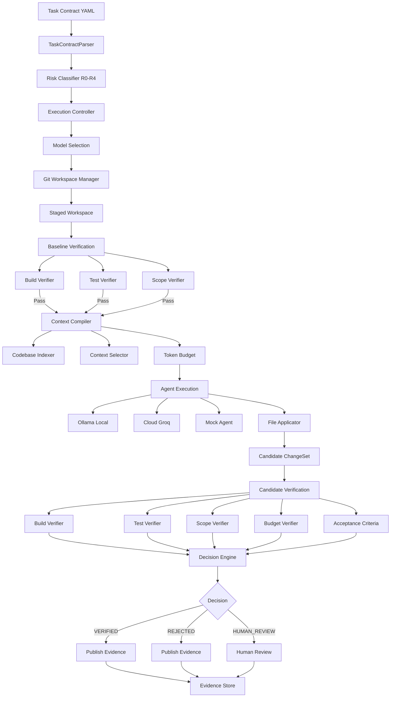

# AECS Pipeline Architecture

## Visão Geral

O AECS (Agentic Engineering Control System) é uma camada de controle adaptativo para engenharia de software com IA. Ele supervisona agentes de código com verificação determinística, orçamento e rastreabilidade.

## Diagrama do Pipeline

## Componentes Principais

### 1. Task Contract (YAML)
Define o contrato da tarefa:
- **Objective**: O que fazer
- **Acceptance**: Critérios de aceitação
- **Scope**: Arquivos permitidos/forbidden
- **Budget**: Tokens, USD, tempo, retries
- **Execution**: Docker sandbox, capabilities
- **Verification**: Build, tests, scope, security

### 2. Risk Classifier (R0-R4)
Classifica o risco da tarefa:
- **R0**: Baixo risco (docs, comments)
- **R1**: Médio risco (bug fixes)
- **R2**: Alto risco (refactors)
- **R3**: Muito alto (breaking changes)
- **R4**: Crítico (security, database)

### 3. Context Compiler
Prepara o contexto para o agent:
- **Codebase Indexer**: Indexa arquivos do repositório
- **Context Selector**: Seleciona arquivos relevantes
- **Token Budget**: Controla tamanho do contexto

### 4. Agent Execution
Executa o agent de código:
- **Ollama**: Modelos locais (qwen2.5-coder)
- **Cloud**: Groq API (openai/gpt-oss-20b)
- **Mock**: Para testes

### 5. Docker Sandbox
Isola a execução:
- Container efêmero
- Workspace read-only
- Writable mounts para bin/obj
- Network access controlado
- Resource limits (CPU, memory, processes)

### 6. Verification DAG
Verifica o candidato:
- **Build**: Compilação
- **Tests**: Testes unitários
- **Scope**: Arquivos dentro do escopo
- **Budget**: Dentro do orçamento
- **Acceptance**: Critérios de aceitação

### 7. Decision Engine
Toma a decisão final:
- **VERIFIED**: Todos os verificadores passaram
- **REJECTED**: Algum verificador falhou
- **HUMAN_REVIEW**: Requer revisão humana

### 8. Evidence Store
Armazena evidências:
- JSON ou PostgreSQL
- Registros assinados
- Cadeia de auditoria

## Fluxo de Execução

1. **Parse**: Lê o Task Contract YAML
2. **Classify**: Classifica o risco
3. **Stage**: Cria workspace isolado (git worktree)
4. **Baseline**: Verifica o estado atual (build + tests)
5. **Context**: Compila contexto relevante
6. **Execute**: Roda o agent (local ou cloud)
7. **Apply**: Aplica mudanças ao workspace
8. **Verify**: Verifica o candidato
9. **Decide**: Toma decisão final
10. **Publish**: Salva evidências

## Métricas

- **VCC**: Verified Code Changes
- **CPVC**: Cost per Verified Code Change
- **First-pass rate**: % de tasks verificadas na primeira tentativa
- **Budget compliance**: % dentro do orçamento

## Segurança

- Docker sandbox isolado
- Workspace read-only por padrão
- Writable mounts controlados
- Network access restrito
- Evidence assinada criptograficamente
- Scope enforcement (allowed/forbidden paths)
