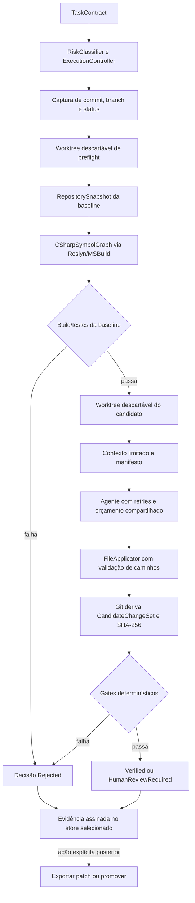

# Arquitetura executável do AECS

Este documento descreve o comportamento conectado à CLI no estado atual do repositório. A visão de longo prazo permanece no [Documento de Fundação Técnica](../AECS_Fundacao_Tecnica_v0.1.md), e as decisões estáveis ficam nos [ADRs](adr/README.md).

## Princípio central

O AECS separa duas categorias de responsabilidade:

- **descoberta probabilística:** geração de código, classificação inicial, seleção de contexto e proposta de mudança;
- **enforcement determinístico:** isolamento Git, caminhos seguros, orçamento, escopo, build, testes, critérios de aceite, decisão e promoção.

Uma resposta do modelo nunca é autoridade sobre quais arquivos realmente mudaram nem permissão para escrever no checkout original. Essa decisão está formalizada no [ADR-007](adr/ADR-007-staged-trust-boundary-and-controlled-promotion.md).

## Fluxo staged

O pipeline executa as seguintes etapas:

1. `TaskContractParser` converte o YAML, e `RiskClassifier` pode elevar o risco declarado.
2. `ExecutionBudgetScope` inicia um wall clock compartilhado por preflight, agente, retries e verificações.
3. `GitWorkspaceManager` resolve a raiz Git e captura `HEAD`, branch e status. Uma working tree suja é recusada.
4. `RepositorySnapshotBuilder` lê exclusivamente a árvore Git do commit no worktree detached e produz o inventário versionado e endereçado por conteúdo da baseline.
5. `RoslynSymbolGraphBuilder` abre soluções e projetos C# autorizados pelo snapshot e produz o grafo semântico versionado, com opções, versões, diagnósticos, limites e hashes estáveis.
6. O mesmo worktree temporário executa build e a matriz de suites da baseline conforme o perfil do contrato. Somente falha de gate obrigatório impede a chamada do agente; gates opcionais permanecem na evidência.
7. Depois de confirmar que o checkout original não mudou, um segundo worktree detached é criado no mesmo commit.
8. `RepositoryContextCompiler` seleciona contexto dentro do escopo, aplica limites e entrega ao agente conteúdo e prompt acompanhados por um manifesto.
9. `AgentExecutionCoordinator` chama o runtime e repete apenas falhas transitórias, rate limit e timeout enquanto ainda houver tentativas, tokens, custo e tempo.
10. `FileApplicator` interpreta blocos `FILE:`, valida todos os destinos e somente então escreve no worktree isolado.
11. Git adiciona o estado do worktree e deriva o `CandidateChangeSet`: arquivos adicionados, modificados ou removidos, diff binário e SHA-256. Alegações de arquivos feitas pelo agente não substituem essa leitura.
12. Os verificadores avaliam os pré-requisitos da trust boundary e, quando habilitados, build, testes, regras semânticas e critérios de aceite.
13. `DecisionEngine` exige exatamente um `Pass` para cada gate obrigatório. Resultado ausente, duplicado, `Skip`, `Fail` ou `Error` rejeita a execução.
14. O worktree é removido, o checkout original é conferido novamente e o `IExecutionEvidenceStore` selecionado (`json` ou `postgres`) persiste o resultado autenticado.

## Invariantes da trust boundary

| Entrada ou estado | Autoridade aceita | Enforcement |
| --- | --- | --- |
| Caminhos na resposta do agente | `FileApplicator` | rejeita caminho absoluto, traversal, `.git`, symlink/junction e destino duplicado; a validação é all-or-nothing antes da escrita |
| Arquivos alterados | Git no worktree | `CandidateChangeSet.ChangedFiles` vem de `git diff --cached --name-status`, não de `AgentRunResult.FilesChanged` |
| Conteúdo do candidato | diff Git persistido | o SHA-256 liga a evidência ao patch exato |
| Estrutura da baseline | árvore Git do commit isolado | o snapshot usa caminhos relativos e IDs de blobs, sem confiar no filesystem não versionado |
| Estado do original | commit, branch e status capturados | é revalidado após preflight, antes de publicar e antes de qualquer promoção |
| Resultado de comandos | processo real | argumentos, working directory, duração, saída, exit code, timeout e cancelamento são preservados |
| Critério de aceite | verificador ou teste declarado | texto sem evidência executável não é suficiente para um critério obrigatório |
| Permissão para promover | evidência + confirmação externa | o agente não pode tornar seu próprio candidato elegível nem aprová-lo |

Os arquivos são escritos antes da verificação de escopo, mas somente no worktree descartável. Uma violação produz evidência e decisão `Rejected`; ela nunca é copiada automaticamente para o checkout original.

## Worktrees e baseline

O repositório informado à CLI precisa:

- pertencer a um repositório Git com `HEAD` válido;
- permitir que Git identifique a referência atual (`HEAD` também é aceito em checkout detached);
- não possuir alterações tracked, staged ou untracked;
- continuar no mesmo commit, branch e status durante toda a execução.

Preflight e candidato usam worktrees separados em `%TEMP%`/`$TMPDIR`, ambos detached no commit da baseline. A limpeza usa token não cancelável para que timeout ou cancelamento não deixem worktrees do agente ativos. O AECS detecta mudanças concorrentes no checkout original e falha fechado; ele não bloqueia processos externos durante uma execução staged.

## RepositorySnapshot da baseline

Antes de build ou testes, `RepositorySnapshotBuilder` executa `git ls-tree` contra o commit autenticado. O resultado `aecs.repository-snapshot/v1` inventaria arquivos, soluções, projetos, linguagens, frameworks, manifests, pacotes, entrypoints, suites e relações de solução/projeto, sempre com caminhos relativos e sem persistir conteúdo-fonte.

Arquivos usam o object ID do blob Git (`git:<oid>`). O `snapshotHash` SHA-256 cobre o inventário ordenado, as versões do schema/estratégia e a configuração de exclusões; o `configurationHash` cobre somente o perfil de descoberta. Commit, TaskContract e ambiente de ferramentas ficam associados ao snapshot e protegidos pelo envelope autenticado, mas não entram no endereço de conteúdo. Assim, conteúdo e configuração iguais mantêm o mesmo hash mesmo em outro runtime, enquanto divergências ambientais continuam explícitas.

Diretórios de VCS, IDE, dependências, builds e artefatos são excluídos por padrão. O perfil pode acrescentar diretórios relativos; arquivos sensíveis, binários de build, symlinks Git e submodules não entram no inventário. Manifests reconhecidos são lidos com limite de 8 MiB, XML sem DTD e validação contra traversal/reparse points. Detalhes estão em [RepositorySnapshot determinístico](repository-snapshot.md).

## Perfil de build e suites

`execution.working_directory` define um diretório relativo à raiz do worktree e `execution.target` aponta para uma solução ou projeto `.sln`, `.slnx`, `.csproj`, `.fsproj` ou `.vbproj`. Caminhos absolutos, traversal, `.git` e links de filesystem são recusados.

Quando build ou o gate legado de testes estão habilitados, o target explícito é obrigatório. Sem `execution.test_suites`, o perfil compatível executa:

- `dotnet build <target>` na baseline e no candidato;
- `dotnet test <target> --no-build` depois de um build aprovado;
- `dotnet test <target> --no-build --filter <reference>` para evidência de aceite do tipo `test`.

Com `execution.test_suites.version: aecs.test-suites/v1`, unitários, integração e aceite têm target, argumentos estruturados, modo (`required`, `optional`, `disabled`) e timeout separados. As categorias habilitadas executam na baseline e no candidato como `UnitTests`, `IntegrationTests` e `AcceptanceTests`. O controlador acrescenta logger/result directory TRX, persiste descoberta e contagens e falha fechado quando um gate obrigatório executa zero testes ou não produz resultado. Testes filtrados de critérios de aceite reutilizam o perfil `acceptance` no candidato.

O process runner consome `stdout` e `stderr` de forma assíncrona, encerra a árvore de processos em timeout/cancelamento e registra cada comando. Build e gates de teste obrigatórios da baseline que não produzam `Pass` encerram o fluxo antes do agente; falhas opcionais permanecem informativas.

## Contexto compilado

Toda execução que ultrapassa o preflight chama `RepositoryContextCompiler` no worktree do candidato. A implementação atual:

- usa o `CSharpSymbolGraph` Roslyn válido como única autoridade para tipos, membros, namespaces, herança e referências; em falha de carga, mantém apenas inventário textual de arquivos, sem inferir semântica por regex;
- restringe os arquivos aos padrões de `scope.allowed` e exclui `scope.forbidden`;
- cria sementes por objetivo, critérios de aceite, escopo, caminhos e símbolos; depois expande dependências, referências reversas, tipos parciais e testes pelo grafo até profundidade configurável, com proteção contra ciclos;
- omite arquivos sensíveis como `.env*`, `secrets.json`, chaves e certificados;
- resolve um contador por adaptador/modelo e usa, na ausência de tokenizer exato, o número de bytes UTF-8 como limite superior conservador;
- calcula o orçamento efetivo como o menor teto entre configuração, contrato e janela do modelo menos saída reservada e overhead do prompt;
- limita por padrão o contexto a 12 mil tokens, 48 mil caracteres totais, 4 mil tokens e 16 mil caracteres por arquivo;
- registra para cada arquivo elegível a posição, pontuação, relação, motivos, decisão (`included`, `truncated` ou `omitted`), tokens e hashes original/incluído.

O pacote nunca ultrapassa o orçamento efetivo calculado pelo contador resolvido. Se nem o cabeçalho mínimo couber, o prompt fica vazio e as omissões continuam explícitas no manifesto. O `ContextManifest` v2 é fingerprintado por inteiro e liga baseline, snapshot, grafo, perfil do modelo, tokenizer e decisões; a leitura da evidência recalcula esses vínculos. Um escopo `allowed` vazio produz contexto de código vazio. Em falha de preflight, a evidência contém um manifesto `not-compiled`. Detalhes estão em [Context Compiler orientado ao grafo](context-compiler.md) e [CSharpSymbolGraph determinístico](csharp-symbol-graph.md).

## Gates e comportamento fail-closed

Os gates sempre obrigatórios são:

| Gate | Condição de `Pass` |
| --- | --- |
| `AgentSuccess` | a tentativa final do agente terminou com sucesso |
| `Application` | a resposta foi aplicada sem erro de parsing ou caminho |
| `NonEmptyChange` | Git encontrou diff real e ao menos um arquivo alterado |
| `Scope` | todos os caminhos Git respeitam `allowed` e `forbidden` |
| `Budget` | tokens, custo, retries e quantidade de arquivos permanecem nos limites |

Gates condicionais:

- `Build`, quando `verification.build` é `required`;
- `Tests`, somente na compatibilidade sem `test_suites`;
- `UnitTests`, `IntegrationTests` e `AcceptanceTests` em v1; categorias opcionais executam e são exibidas, mas somente as marcadas `required` bloqueiam;
- `AcceptanceCriteria`, quando existe ao menos um critério declarado;
- `EB001-Architecture`, quando `verification.architecture` é `required`;
- nomes listados em `required_semantic_verifiers`;
- qualquer resultado EB crítico que não seja `Pass`, quando `critical_semantic_failures` é `required`.

`security_scan: required` adiciona `SecurityScan` à matriz. O gate inventaria a baseline e o candidato com scanners pluggable de segredos, dependências e padrões; somente findings novos acima da política bloqueiam, enquanto falha ou saída inconclusiva vira `Error`. O inventário `dotnet list` passa pelo runner staged e os scanners embutidos apenas leem arquivos, sem carregar código. Os verificadores EB001–EB005 só executam depois dos pré-requisitos e do build. Exceções de qualquer verificador viram `Error`, não sucesso.

EB005 consulta o `IHistoricalDecisionStore` implementado pelo mesmo backend operacional. Somente versões aprovadas, vigentes e semanticamente relacionadas ao candidato são selecionadas. Regras contraditórias retornam `Ambiguous`, store indisponível retorna `Unavailable` e histórico não aplicável retorna `NoHistory`; nenhum desses estados cria regra implícita. Conflito bloqueante só pode vir de versão aprovada por humano.

Critérios de aceite obrigatórios precisam apontar para um resultado de verificador ou teste filtrado. Para testes, exit code zero sem nenhum caso TRX executado falha. Critérios comportamentais também exigem que o arquivo de teste declarado apareça no diff, salvo evidência equivalente explicitamente autorizada.

Cancelamento, wall clock esgotado, orçamento excedido ou falha permanente do agente produzem decisão `Rejected` e estados terminais específicos (`Cancelled`, `TimedOut`, `BudgetExceeded` ou `AgentFailed`).

## Decisões

- `Verified`: todos os gates obrigatórios estão presentes uma única vez e em `Pass`, sem política de aprovação humana;
- `HumanReviewRequired`: os mesmos gates passaram, mas `approval.production` é `human`;
- `Rejected`: qualquer pré-requisito, gate ou política fail-closed não passou.

`Verified` prova somente o contrato e a matriz de evidências declarados. Não é uma prova formal de correção nem cobre requisitos ausentes do contrato.

## Evidência autenticada

A CLI seleciona explicitamente `JsonExecutionEvidenceStore` ou `PostgreSqlExecutionEvidenceStore`. `AECS_EVIDENCE_STORE` e `--evidence-store` aceitam `json` e `postgres`; o padrão compatível é `json`. Selecionar PostgreSQL exige `AECS_POSTGRES_CONNECTION_STRING` e nunca aciona fallback para arquivo em caso de erro.

No backend JSON, o diretório padrão é `%LOCALAPPDATA%/AECS/evidence` no Windows e o equivalente retornado por `LocalApplicationData` nas demais plataformas; `AECS_EVIDENCE_PATH` pode sobrescrevê-lo. O keyring compartilhado pelos dois backends fica separadamente em `%LOCALAPPDATA%/AECS/keys` e pode ser configurado por `AECS_EVIDENCE_KEY_DIRECTORY`. O store recusa chaves — e, no caso JSON, evidências — localizadas dentro do repositório-alvo.

Cada documento preserva:

- contrato, risco efetivo, execução do agente e cada tentativa;
- consumo agregado de tokens, custo, tempo e motivo de exaustão;
- baseline, comandos e verificações de preflight;
- `RepositorySnapshot` da baseline, configuração de descoberta e proveniência das ferramentas;
- `CSharpSymbolGraph` da baseline, opções efetivas, versões, diagnósticos e vínculo ao snapshot;
- seleção histórica usada por EB005, versões/hash das decisões, supressões e provenance até fonte e símbolo;
- manifesto de contexto;
- `CandidateChangeSet`, comandos do candidato e resultados dos verificadores;
- matriz de suites com descoberta/contagens, matriz de critérios de aceite, decisão final e transições de estado;
- exportações, promoções e replays posteriores.

A criação inicial produz um envelope `aecs.execution-evidence/v1`: JSON canônico, SHA-256 e assinatura RSA-PSS/SHA-256 identificada pelo hash da chave pública. Promoções, exportações e replays são eventos assinados numa única sequência ligada à assinatura anterior, e uma cabeça também assinada cobre a quantidade de eventos e a última assinatura. A leitura rejeita schema legado, campo desconhecido ou duplicado, hash divergente, chave não confiável e cadeia inválida antes de entregar `ExecutionEvidence` ao consumidor.

A criação JSON inicial não sobrescreve uma evidência existente. Acréscimos de promoção ou replay usam locks em processo e em arquivo, escrita temporária e substituição atômica. No PostgreSQL, o agregado completo ocupa JSONB autenticado com projeções indexadas, enquanto promoções e replays são linhas relacionadas e assinadas. Transações, lock de linha e índices únicos tornam save/retry idempotentes e serializam escritores de processos distintos sem perder eventos.

Chaves públicas anteriores permanecem confiáveis depois da rotação; JSON legado sem assinatura falha fechado. Detalhes criptográficos estão em [Integridade das evidências](evidence-integrity.md), e setup, migrations e backup do banco em [Store PostgreSQL](postgresql-evidence-store.md).

## Promoção controlada

Promoção não faz parte do pipeline probabilístico. `CandidatePromotionService` só aceita `Verified`, ou `HumanReviewRequired` com aprovação humana referenciada. Ele revalida identidade da evidência, commit-base, repositório, branch, status e hashes; executa `git apply --check --index`, aplica com `git apply --index` e compara novamente o diff staged ao hash verificado.

Locks por repositório coordenam promoções concorrentes. Falha pós-aplicação ou impossibilidade de persistir a auditoria aciona rollback para a baseline. A mudança permanece staged e nenhum commit é criado. A exportação de patch é uma operação distinta e não modifica o repositório. Detalhes estão em [Promoção controlada](controlled-promotion.md).

## Replay de evidência

`ExecutionReplayService` valida a evidência autenticada, abre um worktree detached no commit-base, reconstrói e compara o `RepositorySnapshot` e o `CSharpSymbolGraph`, aplica o diff persistido e deriva novamente o candidato pelo Git. Sem depender de `IAgentAdapter`, ele repete versões de ferramentas, preflight, comandos, gates e critérios de aceite disponíveis. Hash/arquivos diferentes são divergência do candidato; snapshot, grafo ou ambiente divergente com candidato idêntico é divergência do ambiente; gate ausente recebe classificação própria. O evento assinado preserva os hashes esperado/observado, inclusive do grafo, e o diff de arquivos do snapshot. O checkout original é conferido e preservado. Detalhes estão em [Replay de evidências](evidence-replay.md).

## Evidence Graph

`IEvidenceGraphSource` projeta o agregado somente depois da validação criptográfica feita pelo store. `EvidenceGraphService` expõe listagem e traço com filtros por task, run, candidato, baseline, decisão e promoção. Snapshot e grafo semântico são nós próprios ligados à baseline, execução e contexto por referências explícitas. IDs e arestas são determinísticos; referências inconsistentes produzem diagnóstico e nenhuma relação inferida. JSON e DOT são visões derivadas, não novas fontes de verdade. Toda leitura exige principal e caminho exato do repositório autenticado; listagens omitem outros escopos e leituras diretas são recusadas. Detalhes estão em [Evidence Graph](evidence-graph.md).

## Experiment Harness

O modo versionado do Experiment Harness lê datasets v1 gerais e o protocolo de contexto A/B
v2, resolve a baseline exata e expande tarefas × variantes × repetições. Cada combinação usa o
isolamento staged existente, recebe run key determinístico e checkpoint imutável. O relatório
`aecs.experiment-report/v2` preserva ambiente, falhas individuais, pares, distribuições,
incerteza, conclusão H1 e links para todas as evidências produzidas. Consulte
[Experiment Harness reproduzível](experiment-harness.md).

## Mapa de componentes

| Projeto | Responsabilidade conectada |
| --- | --- |
| `AECS.Domain` | contratos, candidatos, evidências, decisões e interfaces sem dependência de infraestrutura |
| `AECS.Application` | pipeline staged, contexto, orçamento/retries, gates, decisão, replay e promoção |
| `AECS.Infrastructure` | runtimes mock/Ollama/cloud, processos, stores autenticados JSON/PostgreSQL e fundações Docker |
| `AECS.Cli` | `run`, `experiment`, `jarvis`, `evidence`, `replay`, `promote` e `export-patch` |
| `AECS.UnitTests` | regras isoladas, parsing, adapters, verificação e control kernel |
| `AECS.IntegrationTests` | Git e PostgreSQL reais, concorrência, rollback e E2E reproduzível do AgronomoPlus |

A solução é um monólito modular conforme o [ADR-002](adr/ADR-002-modular-monolith.md). O fluxo staged mantém Git e os enforcers estruturais no controlador, enquanto comandos que carregam código ou ferramentas do repositório passam pelo runner Docker e por capabilities preventivas. O agente produz blocos de arquivo, mas não recebe uma interface de shell.

## Limitações atuais

- operações Git e verificadores estruturais permanecem no host; comandos do repositório usam Docker por padrão, mas `runtime: host` continua disponível como override explícito de desenvolvimento confiável;
- egress por destino específico ainda não possui enforcer: a rede fica negada ou exige a concessão explícita e ampla `"*"` para usar Docker `bridge`;
- ambos os stores assinam a evidência, mas o keyring local não é um HSM/KMS e PostgreSQL, sozinho, não é uma âncora externa imutável capaz de detectar rollback coordenado de banco e chaves;
- o grafo semântico cobre C#; outras linguagens permanecem apenas no inventário do snapshot, e modelos sem contador registrado usam o limite superior conservador por bytes UTF-8;
- a avaliação MSBuild de design time ocorre no processo do controlador; o limite de memória do grafo cobre o payload estimado, não o working set rígido do processo;
- unit e integration tests compartilham um único comando/verificador;
- a base de vulnerabilidades do `SecurityScan` é uma snapshot local pequena e versionada, não uma réplica completa e atualizada continuamente do GitHub Advisory Database;
- a estimativa de custo do adapter não equivale à fatura final do provedor;
- a promoção é deliberadamente manual ou autorizada por referência de política e não cria commit;
- a interface da CLI ainda pode mudar sem compatibilidade retroativa.

Essas limitações não reabrem a trust boundary: uma capacidade ausente que é declarada obrigatória deve falhar fechado, nunca ser presumida como aprovada.
