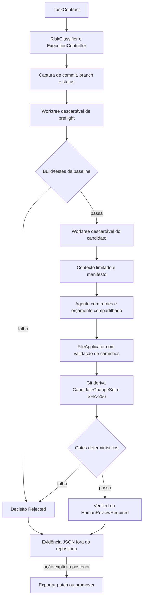

# Arquitetura executável do AECS

Este documento descreve o comportamento conectado à CLI no estado atual do repositório. A visão de longo prazo permanece no [Documento de Fundação Técnica](../AECS_Fundacao_Tecnica_v0.1.md), e as decisões estáveis ficam nos [ADRs](adr/README.md).

## Princípio central

O AECS separa duas categorias de responsabilidade:

- **descoberta probabilística:** geração de código, classificação inicial, seleção de contexto e proposta de mudança;
- **enforcement determinístico:** isolamento Git, caminhos seguros, orçamento, escopo, build, testes, critérios de aceite, decisão e promoção.

Uma resposta do modelo nunca é autoridade sobre quais arquivos realmente mudaram nem permissão para escrever no checkout original. Essa decisão está formalizada no [ADR-007](adr/ADR-007-staged-trust-boundary-and-controlled-promotion.md).

## Fluxo staged

O pipeline executa as seguintes etapas:

1. `TaskContractParser` converte o YAML, e `RiskClassifier` pode elevar o risco declarado.
2. `ExecutionBudgetScope` inicia um wall clock compartilhado por preflight, agente, retries e verificações.
3. `GitWorkspaceManager` resolve a raiz Git e captura `HEAD`, branch e status. Uma working tree suja é recusada.
4. Um worktree detached temporário executa build e testes da baseline conforme o perfil do contrato. Falha nessa fase impede a chamada do agente.
5. Depois de confirmar que o checkout original não mudou, um segundo worktree detached é criado no mesmo commit.
6. `RepositoryContextCompiler` seleciona contexto dentro do escopo, aplica limites e entrega ao agente conteúdo e prompt acompanhados por um manifesto.
7. `AgentExecutionCoordinator` chama o runtime e repete apenas falhas transitórias, rate limit e timeout enquanto ainda houver tentativas, tokens, custo e tempo.
8. `FileApplicator` interpreta blocos `FILE:`, valida todos os destinos e somente então escreve no worktree isolado.
9. Git adiciona o estado do worktree e deriva o `CandidateChangeSet`: arquivos adicionados, modificados ou removidos, diff binário e SHA-256. Alegações de arquivos feitas pelo agente não substituem essa leitura.
10. Os verificadores avaliam os pré-requisitos da trust boundary e, quando habilitados, build, testes, regras semânticas e critérios de aceite.
11. `DecisionEngine` exige exatamente um `Pass` para cada gate obrigatório. Resultado ausente, duplicado, `Skip`, `Fail` ou `Error` rejeita a execução.
12. O worktree é removido, o checkout original é conferido novamente e `JsonExecutionEvidenceStore` persiste o resultado fora do repositório.

## Invariantes da trust boundary

| Entrada ou estado | Autoridade aceita | Enforcement |
| --- | --- | --- |
| Caminhos na resposta do agente | `FileApplicator` | rejeita caminho absoluto, traversal, `.git`, symlink/junction e destino duplicado; a validação é all-or-nothing antes da escrita |
| Arquivos alterados | Git no worktree | `CandidateChangeSet.ChangedFiles` vem de `git diff --cached --name-status`, não de `AgentRunResult.FilesChanged` |
| Conteúdo do candidato | diff Git persistido | o SHA-256 liga a evidência ao patch exato |
| Estado do original | commit, branch e status capturados | é revalidado após preflight, antes de publicar e antes de qualquer promoção |
| Resultado de comandos | processo real | argumentos, working directory, duração, saída, exit code, timeout e cancelamento são preservados |
| Critério de aceite | verificador ou teste declarado | texto sem evidência executável não é suficiente para um critério obrigatório |
| Permissão para promover | evidência + confirmação externa | o agente não pode tornar seu próprio candidato elegível nem aprová-lo |

Os arquivos são escritos antes da verificação de escopo, mas somente no worktree descartável. Uma violação produz evidência e decisão `Rejected`; ela nunca é copiada automaticamente para o checkout original.

## Worktrees e baseline

O repositório informado à CLI precisa:

- pertencer a um repositório Git com `HEAD` válido;
- permitir que Git identifique a referência atual (`HEAD` também é aceito em checkout detached);
- não possuir alterações tracked, staged ou untracked;
- continuar no mesmo commit, branch e status durante toda a execução.

Preflight e candidato usam worktrees separados em `%TEMP%`/`$TMPDIR`, ambos detached no commit da baseline. A limpeza usa token não cancelável para que timeout ou cancelamento não deixem worktrees do agente ativos. O AECS detecta mudanças concorrentes no checkout original e falha fechado; ele não bloqueia processos externos durante uma execução staged.

## Perfil de build e testes

`execution.working_directory` define um diretório relativo à raiz do worktree e `execution.target` aponta para uma solução ou projeto `.sln`, `.slnx`, `.csproj`, `.fsproj` ou `.vbproj`. Caminhos absolutos, traversal, `.git` e links de filesystem são recusados.

Quando build ou testes estão habilitados, o target explícito é obrigatório. O mesmo perfil executa:

- `dotnet build <target>` na baseline e no candidato;
- `dotnet test <target> --no-build` depois de um build aprovado;
- `dotnet test <target> --no-build --filter <reference>` para evidência de aceite do tipo `test`.

O process runner consome `stdout` e `stderr` de forma assíncrona, encerra a árvore de processos em timeout/cancelamento e registra cada comando. Build ou testes da baseline que não produzam `Pass` encerram o fluxo antes do agente.

## Contexto compilado

Toda execução que ultrapassa o preflight chama `RepositoryContextCompiler` no worktree do candidato. A implementação atual:

- indexa arquivos C# e símbolos simples, ignorando `.git`, outputs, dependências vendorizadas, diretórios ocultos e reparse points;
- restringe os arquivos aos padrões de `scope.allowed` e exclui `scope.forbidden`;
- ranqueia por objetivo, critérios de aceite, caminhos, símbolos e testes relacionados;
- omite arquivos sensíveis como `.env*`, `secrets.json`, chaves e certificados;
- limita por padrão a 12 mil tokens estimados, 48 mil caracteres totais e 16 mil por arquivo, sempre respeitando um orçamento de tokens menor;
- registra hash do conteúdo original, hash do trecho incluído, símbolos, truncamento, arquivos omitidos e hash do manifesto.

A estimativa usa quatro caracteres por token e não substitui a telemetria do provedor. Um escopo `allowed` vazio produz contexto de código vazio; o cabeçalho e o manifesto ainda são determinísticos. Em falha de preflight, a evidência contém um manifesto `not-compiled`.

## Gates e comportamento fail-closed

Os gates sempre obrigatórios são:

| Gate | Condição de `Pass` |
| --- | --- |
| `AgentSuccess` | a tentativa final do agente terminou com sucesso |
| `Application` | a resposta foi aplicada sem erro de parsing ou caminho |
| `NonEmptyChange` | Git encontrou diff real e ao menos um arquivo alterado |
| `Scope` | todos os caminhos Git respeitam `allowed` e `forbidden` |
| `Budget` | tokens, custo, retries e quantidade de arquivos permanecem nos limites |

Gates condicionais:

- `Build`, quando `verification.build` é `required`;
- `Tests`, quando unit ou integration tests são `required`; ambos usam hoje o mesmo verificador `dotnet test`;
- `AcceptanceCriteria`, quando existe ao menos um critério declarado;
- `EB001-Architecture`, quando `verification.architecture` é `required`;
- nomes listados em `required_semantic_verifiers`;
- qualquer resultado EB crítico que não seja `Pass`, quando `critical_semantic_failures` é `required`.

`security_scan: required` adiciona `SecurityScan` à matriz, mas ainda não existe implementação desse verificador; por isso o resultado é rejeitado por gate ausente. Os verificadores EB001–EB005 só executam depois dos pré-requisitos e do build. Exceções de qualquer verificador viram `Error`, não sucesso.

Critérios de aceite obrigatórios precisam apontar para um resultado de verificador ou teste filtrado. Para testes, exit code zero sem nenhum caso TRX executado falha. Critérios comportamentais também exigem que o arquivo de teste declarado apareça no diff, salvo evidência equivalente explicitamente autorizada.

Cancelamento, wall clock esgotado, orçamento excedido ou falha permanente do agente produzem decisão `Rejected` e estados terminais específicos (`Cancelled`, `TimedOut`, `BudgetExceeded` ou `AgentFailed`).

## Decisões

- `Verified`: todos os gates obrigatórios estão presentes uma única vez e em `Pass`, sem política de aprovação humana;
- `HumanReviewRequired`: os mesmos gates passaram, mas `approval.production` é `human`;
- `Rejected`: qualquer pré-requisito, gate ou política fail-closed não passou.

`Verified` prova somente o contrato e a matriz de evidências declarados. Não é uma prova formal de correção nem cobre requisitos ausentes do contrato.

## Evidência JSON

A CLI usa `JsonExecutionEvidenceStore`. O diretório padrão é `%LOCALAPPDATA%/AECS/evidence` no Windows e o equivalente retornado por `LocalApplicationData` nas demais plataformas; `AECS_EVIDENCE_PATH` pode sobrescrevê-lo. O store recusa um diretório de evidência localizado dentro do repositório-alvo.

Cada documento preserva:

- contrato, risco efetivo, execução do agente e cada tentativa;
- consumo agregado de tokens, custo, tempo e motivo de exaustão;
- baseline, comandos e verificações de preflight;
- manifesto de contexto;
- `CandidateChangeSet`, comandos do candidato e resultados dos verificadores;
- matriz de critérios de aceite, decisão final e transições de estado;
- exportações e promoções posteriores.

A criação inicial não sobrescreve uma evidência existente. Acréscimos de promoção usam locks em processo e em arquivo, escrita temporária e substituição atômica. O backend PostgreSQL existe como fundação, mas não compõe o fluxo da CLI.

## Promoção controlada

Promoção não faz parte do pipeline probabilístico. `CandidatePromotionService` só aceita `Verified`, ou `HumanReviewRequired` com aprovação humana referenciada. Ele revalida identidade da evidência, commit-base, repositório, branch, status e hashes; executa `git apply --check --index`, aplica com `git apply --index` e compara novamente o diff staged ao hash verificado.

Locks por repositório coordenam promoções concorrentes. Falha pós-aplicação ou impossibilidade de persistir a auditoria aciona rollback para a baseline. A mudança permanece staged e nenhum commit é criado. A exportação de patch é uma operação distinta e não modifica o repositório. Detalhes estão em [Promoção controlada](controlled-promotion.md).

## Mapa de componentes

| Projeto | Responsabilidade conectada |
| --- | --- |
| `AECS.Domain` | contratos, candidatos, evidências, decisões e interfaces sem dependência de infraestrutura |
| `AECS.Application` | pipeline staged, contexto, orçamento/retries, gates, decisão e promoção |
| `AECS.Infrastructure` | runtimes mock/Ollama/cloud, processos, evidência JSON e fundações PostgreSQL/Docker |
| `AECS.Cli` | `run`, `experiment`, `jarvis`, `promote` e `export-patch` |
| `AECS.UnitTests` | regras isoladas, parsing, adapters, verificação e control kernel |
| `AECS.IntegrationTests` | Git real, concorrência, rollback e E2E reproduzível do AgronomoPlus |

A solução é um monólito modular conforme o [ADR-002](adr/ADR-002-modular-monolith.md). `ControlKernel`, PostgreSQL e Docker mantêm componentes de fundação, mas o fluxo staged hoje conecta diretamente os enforcers/verificadores, o store JSON e processos no host.

## Limitações atuais

- o agente e os verificadores executam no host; o sandbox Docker ainda não envolve a CLI padrão;
- a evidência JSON não possui assinatura criptográfica nem armazenamento imutável externo;
- o compilador de contexto indexa apenas C# e usa tokenização aproximada;
- unit e integration tests compartilham um único comando/verificador;
- `SecurityScan` não foi implementado;
- a estimativa de custo do adapter não equivale à fatura final do provedor;
- a promoção é deliberadamente manual ou autorizada por referência de política e não cria commit;
- a interface da CLI ainda pode mudar sem compatibilidade retroativa.

Essas limitações não reabrem a trust boundary: uma capacidade ausente que é declarada obrigatória deve falhar fechado, nunca ser presumida como aprovada.
